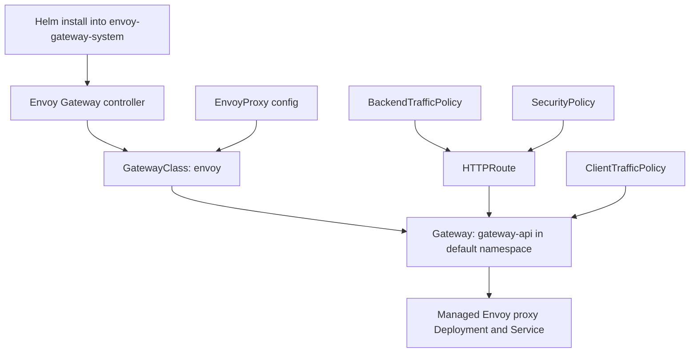

# Envoy Gateway Background

This note explains the moving parts in the Envoy Gateway sample in this folder and how they relate to the Gateway API resources used by the repo.

## Relationship diagram



The important thing to notice is that the Helm install does not directly create your application routing rules. It installs the controller. The controller then watches `GatewayClass`, `Gateway`, routes, and policies, and creates the Envoy infrastructure needed to serve traffic.

## Scope of each resource

Some of these resources are cluster-wide, and some are namespaced. That difference matters when you are troubleshooting.

- `envoy-gateway-system` is a namespace.
- `GatewayClass` is cluster-scoped.
- `Gateway` is namespaced.
- `HTTPRoute` is namespaced.
- `EnvoyProxy` is namespaced.
- `ClientTrafficPolicy`, `BackendTrafficPolicy`, and `SecurityPolicy` are namespaced custom resources.

This means:

- if `GatewayClass` is missing, you check cluster-wide resources
- if `Gateway` is missing, you check the target namespace such as `default`
- if the controller Pods are unhealthy, you check `envoy-gateway-system`

## Core pieces

### `envoy-gateway-system`

This is a Kubernetes namespace.

It contains the Envoy Gateway controller installed by Helm. The controller watches Gateway API resources and creates or updates the Envoy data plane that serves traffic.

Typical resources in this namespace include:

- the `envoy-gateway` Deployment
- controller Pods
- controller Services
- generated Envoy proxy Deployments and Services created for Gateways

This namespace is not your application namespace. It is the controller and infrastructure namespace used by Envoy Gateway.

### `GatewayClass`

This is a cluster-scoped Gateway API resource.

In this sample, [`01-gatewayclass.yaml`](./01-gatewayclass.yaml) defines a `GatewayClass` named `envoy`:

```yaml
apiVersion: gateway.networking.k8s.io/v1
kind: GatewayClass
metadata:
  name: envoy
spec:
  controllerName: gateway.envoyproxy.io/gatewayclass-controller
```

This tells Kubernetes that Gateways using class `envoy` should be reconciled by the Envoy Gateway controller.

You can think of `GatewayClass` as a contract between Kubernetes and a controller implementation:

- Kubernetes stores the object
- the controller advertises a `controllerName`
- any `Gateway` that references that class is picked up by the matching controller

If the `GatewayClass` exists but nothing reacts to it, the controller may not be running or may not match the `controllerName`.

### `Gateway`

This is the actual Gateway API instance you want to expose traffic for.

In this sample, [`02-gateway.yaml`](./02-gateway.yaml) creates a `Gateway` named `gateway-api` in the `default` namespace and points it at:

```yaml
gatewayClassName: envoy
```

That means the Envoy Gateway controller should realize this Gateway.

The `Gateway` describes listener intent, not detailed request routing logic. In this sample, the `Gateway` declares listeners on ports `80` and `443`, while `HTTPRoute` resources decide where requests actually go.

In other words:

- `GatewayClass` says who owns the gateway implementation
- `Gateway` says what entry points should exist
- `HTTPRoute` says how requests should be matched and forwarded

### `EnvoyProxy`

This is an Envoy Gateway-specific custom resource, not a standard Gateway API resource.

It lets you tune the implementation details of the managed Envoy deployment, such as replicas, services, and infrastructure settings.

In this sample, [`02.1-gateway-config.yaml`](./02.1-gateway-config.yaml) attaches an `EnvoyProxy` configuration to the `GatewayClass`.

This is one of the key ideas to understand: `Gateway` expresses portable Gateway API intent, while `EnvoyProxy` expresses Envoy Gateway-specific implementation tuning.

If you switched to another Gateway API controller, your `Gateway` and `HTTPRoute` might still make sense, but `EnvoyProxy` would not.

### Routes and policies

Resources such as `HTTPRoute`, `ClientTrafficPolicy`, `BackendTrafficPolicy`, and `SecurityPolicy` describe how traffic should be routed or filtered.

The Envoy Gateway controller reads those resources and programs the managed Envoy proxy accordingly.

Roughly:

- `HTTPRoute` controls matching and backend forwarding
- `ClientTrafficPolicy` controls client-facing behavior such as mTLS or connection settings
- `BackendTrafficPolicy` controls backend-facing behavior such as rate limiting or backend traffic settings
- `SecurityPolicy` controls auth and security behaviors such as CORS or basic auth

## Control plane vs data plane

There are two different layers involved:

### Control plane

The Envoy Gateway controller runs in `envoy-gateway-system` and watches Kubernetes resources.

### Data plane

The actual Envoy proxy instances are created and managed by the controller. These are what receive and handle HTTP or HTTPS traffic.

In this sample, applying the `Gateway` causes Envoy Gateway to create the backing proxy resources.

When a request arrives, it does not hit the controller Pod. It hits the Envoy proxy data plane created for your `Gateway`. The controller only configures and reconciles that proxy.

That distinction helps when debugging:

- configuration problems usually involve the control plane and resource reconciliation
- traffic problems usually involve the data plane, listeners, services, routes, or policy attachments

## What gets created when

This is the most useful mental timeline for the sample.

### After Helm install

You get the Envoy Gateway controller in `envoy-gateway-system`.

At this point, you have a controller, but not yet an actual application gateway for your traffic.

### After applying `01-gatewayclass.yaml`

You get a `GatewayClass` named `envoy`.

This registers the class that your later `Gateway` will use.

Useful verification commands:

```bash
kubectl apply -f kubernetes/gateway-api/envoy/01-gatewayclass.yaml
kubectl get gatewayclass
kubectl describe gatewayclass envoy
```

Notice there is no namespace flag here. `GatewayClass` is cluster-scoped.

### After applying `02-gateway.yaml`

You create the logical Gateway object in `default`.

Envoy Gateway sees it and creates the managed Envoy proxy infrastructure, typically in `envoy-gateway-system`. That is why you start seeing extra Pods and Services there.

Useful verification commands:

```bash
kubectl apply -f kubernetes/gateway-api/envoy/02-gateway.yaml
kubectl get gateway -n default
kubectl describe gateway gateway-api -n default
kubectl -n envoy-gateway-system get pods
kubectl -n envoy-gateway-system get svc
```

The first two checks verify the `Gateway` object itself. The last two checks verify the generated Envoy infrastructure created by the controller.

### After applying `HTTPRoute` and policies

The controller updates the Envoy proxy configuration so traffic is matched, filtered, authenticated, and forwarded according to those resources.

## Why resources appear in different namespaces

This often confuses people the first time they test Gateway API.

Your `Gateway` can live in one namespace, such as `default`, while the controller-created infrastructure runs in another namespace, such as `envoy-gateway-system`.

That is normal in this sample.

The separation is roughly:

- application-facing config objects can live with the app or in a user namespace
- controller and generated infrastructure live in the controller namespace

## Typical flow in this repo

1. Create a kind cluster.
2. Install the Gateway API CRDs from the introduction guide.
3. Install Envoy Gateway CRDs.
4. Install the Envoy Gateway Helm chart.
5. Apply the `GatewayClass`.
6. Apply the `Gateway`.
7. Apply routes and policies.

## Why `kubectl get gatewayclass` may show nothing or fail

There are two different failure modes:

### The CRD is missing

If `gatewayclasses.gateway.networking.k8s.io` does not exist, the cluster does not know what a `GatewayClass` is yet.

Install the Gateway API CRDs first.

### The CRD exists but no object has been created

If the Gateway API CRDs are installed but [`01-gatewayclass.yaml`](./01-gatewayclass.yaml) has not been applied, `kubectl get gatewayclass` may return no resources.

## How to inspect cluster-level configuration

If you want to see what is set at the cluster scope, rather than inside a namespace, start with:

```bash
kubectl api-resources --namespaced=false
```

That shows the cluster-scoped resource types available on the cluster.

To see the actual cluster-scoped objects that exist, these are the most useful checks for this sample:

```bash
kubectl get gatewayclass
kubectl get crd | grep -E 'gateway|envoy'
kubectl get namespaces
kubectl get nodes
kubectl get clusterrole,clusterrolebinding | grep -E 'envoy|gateway'
kubectl get validatingadmissionpolicy
kubectl get validatingadmissionpolicybinding
```

For a broad cluster-scoped inventory, use:

```bash
for r in $(kubectl api-resources --verbs=list --namespaced=false -o name); do
  echo "=== $r ==="
  kubectl get "$r" --ignore-not-found
  echo
done
```

This is useful when you want to answer questions like:

- what did Gateway API install at the cluster level?
- what did Envoy Gateway add beyond namespaced resources?
- is a missing behavior caused by a cluster-scoped object never being created?

## Fast verification sequence for this sample

If you want the shortest practical check sequence for the core resources, use:

```bash
# apply 01
kubectl apply -f kubernetes/gateway-api/envoy/01-gatewayclass.yaml

# verify 01
kubectl get gatewayclass
kubectl describe gatewayclass envoy

# apply 02
kubectl apply -f kubernetes/gateway-api/envoy/02-gateway.yaml

# verify 02
kubectl get gateway -n default
kubectl describe gateway gateway-api -n default
kubectl -n envoy-gateway-system get pods
kubectl -n envoy-gateway-system get svc
```

This sequence is usually enough to tell whether:

- the class exists
- the gateway object was created
- the controller reconciled it
- the backing Envoy proxy infrastructure appeared

## Understanding Gateway status conditions

When you run:

```bash
kubectl get gateway -n default
```

you may see status columns such as `Accepted`, `Programmed`, or other condition summaries.

### `Accepted`

This usually means the controller accepts ownership of the `Gateway`.

- `Accepted=True` means the controller recognizes the `GatewayClass` and accepts the `Gateway` for reconciliation.
- `Accepted=False` usually means the class is invalid, the controller does not own it, or the `Gateway` itself is invalid at a high level.

### `ResolvedRefs`

This means references used by the `Gateway` were resolved correctly.

Typical examples include:

- TLS certificate secrets
- referenced classes or related objects

If `ResolvedRefs=False`, a common cause in this sample is a missing or invalid `secret-tls` referenced by the HTTPS listener in [`02-gateway.yaml`](./02-gateway.yaml).

### `Programmed`

This means the controller successfully translated the `Gateway` into working underlying infrastructure and data plane configuration.

- `Programmed=True` means the Gateway is fully realized by the controller.
- `Programmed=False` means the `Gateway` object exists, but Envoy Gateway has not successfully finished programming the managed Envoy proxy yet.

Common causes of `Programmed=False` in this sample include:

- the Envoy Gateway controller is unhealthy
- the generated Envoy proxy Deployment or Service failed to come up
- an HTTPS listener is invalid
- a TLS secret such as `secret-tls` is missing or malformed
- the controller accepted the `Gateway`, but reconciliation failed afterward

### Best commands to inspect conditions

```bash
kubectl describe gateway gateway-api -n default
kubectl get gateway gateway-api -n default -o yaml
```

In `describe` output, look at:

- `Conditions`
- `Listeners`

In YAML output, look at:

- `status.conditions`
- `status.listeners`

These fields usually contain the exact reason and message for failures such as `Programmed=False`.

## Common setup pitfalls in this sample

### 1. Running commands from the wrong directory

If you are already in `kubernetes/gateway-api/envoy`, use:

```bash
--values values.yaml
```

If you are at the repository root, use:

```bash
--values kubernetes/gateway-api/envoy/values.yaml
```

### 2. Skipping CRDs before they exist

The main Helm chart is installed with `--skip-crds` in this sample because CRDs are managed separately.

That only works if the required CRDs were installed first.

### 3. Mixing CRD ownership models

Do not install Gateway API CRDs from one place and then let another chart try to manage a different copy unless you know they are compatible.

In this repo, the intended split is:

- Gateway API CRDs from the introduction guide
- Envoy Gateway CRDs from the `gateway-crds-helm` chart
- Envoy Gateway controller from the `gateway-helm` chart with `--skip-crds`

## Troubleshooting map

When something is not working, this quick map helps narrow the layer.

- `kubectl get gatewayclass` fails: Gateway API CRDs are probably missing.
- `kubectl get gatewayclass` works but shows nothing: the class manifest was not applied.
- `kubectl get gateway` works but no proxy Pods appear: the controller may be unhealthy or unable to reconcile the `Gateway`.
- proxy Pods exist but traffic does not route: check `HTTPRoute`, listeners, Services, and backend Pods.
- security or auth behavior is wrong: check the attached policy resource and whether the controller accepted it.

## Mental model

- `envoy-gateway-system` = where the controller runs
- `GatewayClass envoy` = which controller owns the class
- `Gateway gateway-api` = the gateway instance you want
- `EnvoyProxy` = controller-specific infrastructure tuning
- routes and policies = the desired traffic behavior