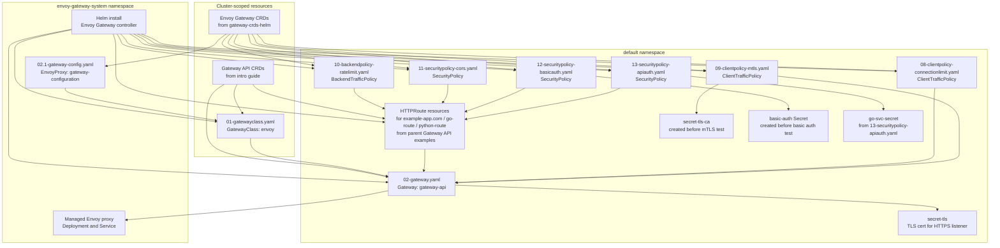

# Envoy Gateway Kubernetes Knowledge Docs

This folder collects the background knowledge needed to understand the Envoy Gateway sample in this directory.

These notes are meant to complement the step-by-step instructions in [`../README.md`](../README.md).

## Topics

- [Scope](./scope.md)
- [Envoy Gateway Concepts](./envoy-gateway-concepts.md)
- [Gateway Status Conditions](./gateway-status-conditions.md)
- [Traffic Exposure and Hostname Mapping](./traffic-exposure-and-hostname-mapping.md)
- [Testing and Troubleshooting](./testing-and-troubleshooting.md)

## Relationship diagram

## Resource reference

| Resource | Kind | Scope | Namespace | Source | Short note |
| --- | --- | --- | --- | --- | --- |
| Gateway API CRDs | `CustomResourceDefinition` | Cluster-scoped | None | Intro guide | Registers Gateway API types like `GatewayClass`, `Gateway`, and `HTTPRoute`. |
| Envoy Gateway CRDs | `CustomResourceDefinition` | Cluster-scoped | None | `gateway-crds-helm` | Registers Envoy Gateway types like `EnvoyProxy`, `ClientTrafficPolicy`, and `SecurityPolicy`. |
| `envoy` | `GatewayClass` | Cluster-scoped | None | [`../01-gatewayclass.yaml`](../01-gatewayclass.yaml) | Declares that Envoy Gateway owns Gateways of this class. |
| `gateway-api` | `Gateway` | Namespaced | `default` | [`../02-gateway.yaml`](../02-gateway.yaml) | Declares HTTP and HTTPS entry points for the sample gateway. |
| `gateway-configuration` | `EnvoyProxy` | Namespaced | `envoy-gateway-system` | [`../02.1-gateway-config.yaml`](../02.1-gateway-config.yaml) | Customizes the generated Envoy infrastructure, such as service name, replicas, and telemetry. |
| Example HTTP routes | `HTTPRoute` | Namespaced | `default` | Parent Gateway API examples | Define hostname and path matching rules and backend forwarding behavior. |
| `connection-limit-policy` | `ClientTrafficPolicy` | Namespaced | `default` | [`../08-clientpolicy-connectionlimit.yaml`](../08-clientpolicy-connectionlimit.yaml) | Applies client-side connection limits to the Gateway. |
| `mtls-policy` | `ClientTrafficPolicy` | Namespaced | `default` | [`../09-clientpolicy-mtls.yaml`](../09-clientpolicy-mtls.yaml) | Requires client certificate validation on the HTTPS listener. |
| `ratelimit-go-httproute` | `BackendTrafficPolicy` | Namespaced | `default` | [`../10-backendpolicy-ratelimit.yaml`](../10-backendpolicy-ratelimit.yaml) | Applies local rate limiting to the `go-route` `HTTPRoute`. |
| `go-route-cors` | `SecurityPolicy` | Namespaced | `default` | [`../11-securitypolicy-cors.yaml`](../11-securitypolicy-cors.yaml) | Adds CORS behavior to the `go-route` `HTTPRoute`. |
| `go-route-basicauth` | `SecurityPolicy` | Namespaced | `default` | [`../12-securitypolicy-basicauth.yaml`](../12-securitypolicy-basicauth.yaml) | Adds basic authentication to the `go-route` `HTTPRoute`. |
| `go-route-apikeyauth` | `SecurityPolicy` | Namespaced | `default` | [`../13-securitypolicy-apiauth.yaml`](../13-securitypolicy-apiauth.yaml) | Adds API-key based authentication to the `go-route` `HTTPRoute`. |
| `secret-tls` | `Secret` | Namespaced | `default` | Intro guide | Supplies the certificate used by the HTTPS listener on the `Gateway`. |
| `secret-tls-ca` | `Secret` | Namespaced | `default` | Created during mTLS test | Supplies the CA bundle used for client certificate validation. |
| `basic-auth` | `Secret` | Namespaced | `default` | Created during basic auth test | Stores htpasswd credentials for the basic auth policy. |
| `go-svc-secret` | `Secret` | Namespaced | `default` | [`../13-securitypolicy-apiauth.yaml`](../13-securitypolicy-apiauth.yaml) | Stores API-key credentials referenced by the API auth policy. |
| Envoy Gateway controller | `Deployment` and related resources | Namespaced | `envoy-gateway-system` | Helm install | Watches the resources above and reconciles them into Envoy data-plane state. |
| Managed Envoy proxy | Generated `Deployment` and `Service` | Namespaced | `envoy-gateway-system` | Created by controller | The actual data plane that receives traffic and enforces routing and policy. |

## What this diagram includes

- the base Envoy manifests in this folder: `01`, `02`, and `02.1`
- the optional policy manifests in this folder: `08` through `13`
- the supporting Secrets those manifests rely on
- the `HTTPRoute` resources referenced by the policy manifests, which live in the parent Gateway API examples rather than in this folder

Not every example manifest is intended to be active at the same time. Several policy manifests are alternative demonstrations layered on top of the same `Gateway` and `HTTPRoute` resources.

## Recommended reading order

1. [Scope](./scope.md)
2. [Envoy Gateway Concepts](./envoy-gateway-concepts.md)
3. [Traffic Exposure and Hostname Mapping](./traffic-exposure-and-hostname-mapping.md)
4. [Gateway Status Conditions](./gateway-status-conditions.md)
5. [Testing and Troubleshooting](./testing-and-troubleshooting.md)