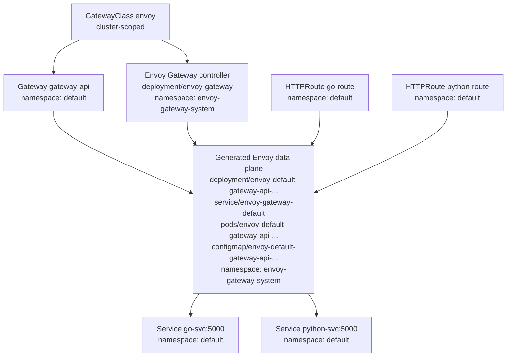

# Kubernetes Scope

This note goes deep on one of the most important Kubernetes concepts in this Envoy Gateway sample: scope.

If scope is not clear, it becomes very hard to debug why a resource is missing, why `kubectl get` returns nothing, or why a controller reacts to one object but not another.

## The two real Kubernetes API scopes

At the Kubernetes API level, there are only two standard object scopes:

1. namespaced
2. cluster-scoped

There is no third standard API scope such as "application scope", "project scope", or "node scope".

That means every resource you create is stored either:

- inside a namespace
- or at the cluster level

## Namespaced resources

Namespaced resources live inside a namespace such as `default` or `envoy-gateway-system`.

Examples from this sample:

- `Gateway`
- `HTTPRoute`
- `EnvoyProxy`
- `ClientTrafficPolicy`
- `BackendTrafficPolicy`
- `SecurityPolicy`
- `Secret`
- `Pod`
- `Service`
- `Deployment`

### How to query namespaced resources

If a resource is namespaced, you usually check it with `-n <namespace>`.

Examples:

```bash
kubectl get gateway -n default
kubectl get httproute -n default
kubectl get pods -n envoy-gateway-system
kubectl get svc -n envoy-gateway-system
```

If you query the wrong namespace, it can look like the object does not exist even though it does.

## Cluster-scoped resources

Cluster-scoped resources live at the cluster level and do not belong to a namespace.

Examples from this sample:

- `GatewayClass`
- `CustomResourceDefinition`
- `Namespace`
- `Node`
- `ClusterRole`
- `ClusterRoleBinding`
- `ValidatingAdmissionPolicy`
- `ValidatingAdmissionPolicyBinding`

### How to query cluster-scoped resources

You do not use a namespace flag for these resources.

Examples:

```bash
kubectl get gatewayclass
kubectl describe gatewayclass envoy
kubectl get crd
kubectl get nodes
kubectl get namespaces
```

If you try using a namespace flag on a cluster-scoped resource, it is usually ignored or conceptually meaningless.

## Scope in this Envoy Gateway sample

The most important scope split in this example is:

### Cluster-scoped

- `GatewayClass envoy` from [`../01-gatewayclass.yaml`](../01-gatewayclass.yaml)
- Gateway API CRDs installed from the parent introduction guide
- Envoy Gateway CRDs installed from `gateway-crds-helm`
- RBAC and admission resources created by Helm

### Namespaced in `default`

- `Gateway gateway-api` from [`../02-gateway.yaml`](../02-gateway.yaml)
- `HTTPRoute` resources from the parent Gateway API examples
- `ClientTrafficPolicy`, `BackendTrafficPolicy`, and `SecurityPolicy` examples in this folder
- support Secrets such as `secret-tls`, `secret-tls-ca`, `basic-auth`, and `go-svc-secret`

### Namespaced in `envoy-gateway-system`

- Envoy Gateway controller Pods
- controller Services
- `EnvoyProxy gateway-configuration` from [`../02.1-gateway-config.yaml`](../02.1-gateway-config.yaml)
- generated Envoy proxy Deployments and Services

## Runtime mapping for the three main Gateway API resources

When people first learn Gateway API, the most common question is this:

"If I create `GatewayClass`, `Gateway`, and `HTTPRoute`, what actual runtime resources do those become?"

Using the current `kind-gatewayapi` sample cluster, the answer is:

| Gateway API resource | API scope | Role | Runtime representation in this cluster |
| --- | --- | --- | --- |
| `GatewayClass` | cluster-scoped | selects the implementation/controller | the Envoy Gateway controller deployment and pod that reconcile Gateway API objects |
| `Gateway` | namespaced | instantiates one gateway data plane | generated Envoy `Deployment`, `Service`, `Pods`, and `ConfigMap` |
| `HTTPRoute` | namespaced | contributes routing rules to a `Gateway` listener | translated route config inside the Envoy proxy; not its own `Deployment` or `Service` |

That means these three resources do not all turn into the same kind of thing.

- `GatewayClass` does not become a proxy Pod by itself.
- `Gateway` is the layer that becomes a concrete proxy fleet.
- `HTTPRoute` usually becomes configuration loaded into that proxy fleet.

## Live example from the current `kind-gatewayapi` cluster

The cluster currently contains:

```bash
kubectl config current-context
# kind-gatewayapi

kubectl get gatewayclass -o wide
# NAME    CONTROLLER                                      ACCEPTED   AGE
# envoy   gateway.envoyproxy.io/gatewayclass-controller   True       ...

kubectl get gateway -A -o wide
# NAMESPACE   NAME          CLASS   ADDRESS   PROGRAMMED   AGE
# default     gateway-api   envoy             False        ...

kubectl get httproute -A -o wide
# NAMESPACE   NAME           HOSTNAMES
# default     go-route       ["example-app.com"]
# default     python-route   ["example-app.com"]
```

## Detailed mapping by layer

### 1. `GatewayClass` maps to the controller implementation

In this sample:

- `GatewayClass` name: `envoy`
- controller name: `gateway.envoyproxy.io/gatewayclass-controller`

That `controllerName` tells Kubernetes which controller is responsible for Gateways that reference this class.

In runtime terms, the important concrete resources are the Envoy Gateway control-plane objects in `envoy-gateway-system`, especially:

- `deployment/envoy-gateway`
- `pod/envoy-gateway-...`
- `service/envoy-gateway`

So the best mental model is:

- `GatewayClass` = implementation contract
- Envoy Gateway controller = process that fulfills that contract

`GatewayClass` is cluster-scoped because it is meant to be reusable across namespaces.

### 2. `Gateway` maps to generated proxy infrastructure

In this sample:

- `Gateway` name: `gateway-api`
- namespace: `default`
- class: `envoy`

This is the resource that caused Envoy Gateway to generate the actual data-plane resources.

Concrete runtime resources currently present in `envoy-gateway-system`:

- `deployment/envoy-default-gateway-api-30a1473e`
- `service/envoy-gateway-default`
- `pod/envoy-default-gateway-api-30a1473e-58df57bdd6-xsdzz`
- `pod/envoy-default-gateway-api-30a1473e-58df57bdd6-z24wj`
- `configmap/envoy-default-gateway-api-30a1473e`

This is the most important thing to understand:

- the `Gateway` object itself lives in `default`
- the generated proxy runtime lives in `envoy-gateway-system`

So the API object and the runtime resources do not have to live in the same namespace.

This is why scope and effect must be kept separate in your mind.

### 3. `HTTPRoute` maps to route configuration, not standalone workloads

In this sample there are two routes:

- `default/go-route`
- `default/python-route`

Each one attaches to `Gateway default/gateway-api` and points to a backend `Service`.

Examples:

- `go-route` forwards to `service/go-svc:5000`
- `python-route` forwards to `service/python-svc:5000`

What they become at runtime is not:

- a Pod
- a Deployment
- a Service

Instead, they become translated listener and route configuration inside the Envoy proxy created for the `Gateway`.

So the mental model is:

- `HTTPRoute` = data-plane config input
- Envoy proxy = data-plane runtime that executes that config

## End-to-end picture



## Important nuance: labels vs owner references

One implementation detail in this live Envoy Gateway sample is worth calling out.

The generated proxy resources are labeled with the owning `Gateway` name and namespace, for example:

- `gateway.envoyproxy.io/owning-gateway-name=gateway-api`
- `gateway.envoyproxy.io/owning-gateway-namespace=default`

That makes it easy to see which proxy resources belong to which `Gateway`.

However, the generated resources may not use the `Gateway` itself as the Kubernetes `ownerReference`.

In this sample, the generated Envoy proxy resources are owned through the controller's implementation model and are shown with a `GatewayClass` owner reference, while still carrying labels that point back to `Gateway gateway-api`.

So when debugging, do not assume that ownership will always be expressed only through `metadata.ownerReferences` on the exact `Gateway` object.

Check both:

- labels
- owner references
- controller-specific reconciliation behavior

## Why `HTTPRoute` feels less visible at runtime

This often confuses people because `HTTPRoute` is very important logically, but it does not usually create a recognizable workload object.

You can think of the three layers like this:

1. `GatewayClass` chooses the implementation.
2. `Gateway` creates the proxy entry point.
3. `HTTPRoute` fills that proxy with match and forward rules.

So if you run `kubectl get deploy,svc,pod -A`, you will usually see the runtime footprint of the `Gateway` much more clearly than the runtime footprint of the `HTTPRoute`.

## Commands that reveal this mapping quickly

```bash
kubectl get gatewayclass -o wide
kubectl get gateway -A -o wide
kubectl get httproute -A -o wide
kubectl get deploy,svc,pod,cm -n envoy-gateway-system -o wide
kubectl describe gateway gateway-api -n default
kubectl describe httproute go-route -n default
kubectl describe httproute python-route -n default
kubectl get deploy,svc,pod,cm -n envoy-gateway-system \
  -L gateway.envoyproxy.io/owning-gateway-name,gateway.envoyproxy.io/owning-gateway-namespace
```

If you remember only one sentence from this section, remember this one:

`GatewayClass` chooses the controller, `Gateway` becomes the live proxy infrastructure, and `HTTPRoute` becomes routing configuration inside that infrastructure.

## Scope versus effect

This is where many people get tripped up.

Scope answers:

- where does the object live in the Kubernetes API?

Effect answers:

- what can this object influence?

Those are not the same thing.

### Example 1: namespaced object with broader effect

A `Gateway` in `default` is still namespaced, but it can cause Envoy Gateway to create data-plane infrastructure in `envoy-gateway-system`.

So:

- API scope: namespaced
- runtime effect: can trigger controller actions beyond its own namespace

### Example 2: policy attachment

A namespaced `SecurityPolicy` attached to an `HTTPRoute` can change how traffic is authenticated or filtered.

So:

- API scope: namespaced
- runtime effect: affects live traffic flowing through the data plane

### Example 3: cluster-scoped ownership object

A `GatewayClass` is cluster-scoped, but by itself it does not serve traffic. It declares which controller owns Gateways of that class.

So:

- API scope: cluster-scoped
- runtime effect: controls controller ownership and reconciliation behavior

## Why `kubectl get all -A` is not enough

`kubectl get all -A` only shows a subset of common namespaced workload resources.

It does not show cluster-scoped resources.

It also does not include many namespaced custom resources that matter for Gateway API or Envoy Gateway.

So it will not show important things like:

- `GatewayClass`
- `CRD`
- `ClientTrafficPolicy`
- `SecurityPolicy`
- `EnvoyProxy`

Use these instead:

```bash
kubectl api-resources --namespaced=false
kubectl get gatewayclass
kubectl get crd | grep -E 'gateway|envoy'
kubectl get gateway -n default
kubectl get httproute -n default
kubectl get pods,svc -n envoy-gateway-system
```

## How to inspect cluster-level resources

To see cluster-scoped resource types:

```bash
kubectl api-resources --namespaced=false
```

To inspect important cluster-scoped resources for this sample:

```bash
kubectl get gatewayclass
kubectl get crd | grep -E 'gateway|envoy'
kubectl get namespaces
kubectl get nodes
kubectl get clusterrole,clusterrolebinding | grep -E 'envoy|gateway'
kubectl get validatingadmissionpolicy
kubectl get validatingadmissionpolicybinding
```

To broadly enumerate cluster-scoped objects:

```bash
for r in $(kubectl api-resources --verbs=list --namespaced=false -o name); do
  echo "=== $r ==="
  kubectl get "$r" --ignore-not-found
  echo
done
```

## How to inspect namespaced resources

If you suspect something is missing, always start by asking which namespace it should be in.

Useful checks:

```bash
kubectl get gateway -n default
kubectl get httproute -n default
kubectl get secret -n default
kubectl get envoyproxy -n envoy-gateway-system
kubectl get pods,svc -n envoy-gateway-system
```

## Fast examples from this conversation

### Why `GatewayClass` was visible without `-n`

Because `GatewayClass` is cluster-scoped.

```bash
kubectl get gatewayclass
kubectl describe gatewayclass envoy
```

### Why `Gateway` needed `-n default`

Because `Gateway gateway-api` is namespaced.

```bash
kubectl get gateway -n default
kubectl describe gateway gateway-api -n default
```

### Why `EnvoyProxy` failed to apply even though `GatewayClass` existed

Because the Gateway API CRDs and Envoy Gateway CRDs are different CRD sets.

Having this succeed:

```bash
kubectl get crd gatewayclasses.gateway.networking.k8s.io
```

does not prove this exists:

```bash
kubectl get crd envoyproxies.gateway.envoyproxy.io
```

That is a scope-adjacent debugging lesson: the object may be namespaced, but if the CRD is missing, the API type does not exist anywhere in the cluster.

## Mental model for learning

When debugging any Kubernetes object, ask these questions in this order:

1. What kind of object is this?
2. Is it namespaced or cluster-scoped?
3. If namespaced, which namespace should it live in?
4. Does the CRD for this type exist?
5. Does the object exist?
6. What controller watches it?
7. What effect should it have if reconciliation succeeds?

This sequence is often enough to narrow most Kubernetes debugging problems very quickly.
