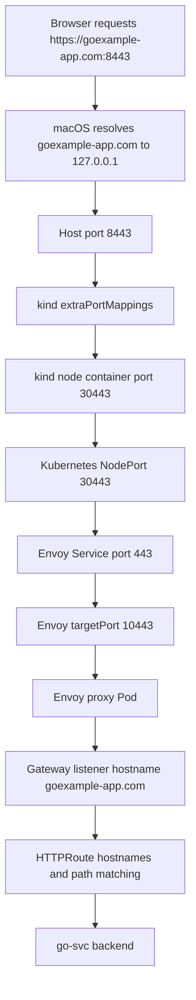

# Stable Browser Testing on macOS with `kind`

This note explains how to make browser testing more stable for the Envoy Gateway sample when you are running Kubernetes with `kind` on macOS.

The short version is:

- `kubectl port-forward` is convenient for quick debugging
- browsers are noisy clients and often cause `port-forward` to reset
- on macOS, the most practical stable setup is:
  - `kind` `extraPortMappings`
  - fixed Gateway service `nodePort` values
  - `/etc/hosts` for hostname resolution
  - a trusted local CA for HTTPS browser tests

## Why browser testing is less stable with `kubectl port-forward`

`kubectl port-forward` is built around short-lived local streams.

That works well for:

- `curl`
- one-off API checks
- narrow route debugging

It is less stable for browsers because browsers often do more than one simple HTTP request.

Examples:

- request the main page
- request `/favicon.ico`
- open extra connections
- retry or preconnect
- close or reset streams aggressively

In this sample, that can look like:

- the real route request succeeds with `200`
- a second browser-driven connection gets rejected or reset
- `kubectl port-forward` exits even though the first request already worked

## The networking problem on macOS

This is the key point.

With `kind`, your Kubernetes node is not a bare-metal host. It is a Docker container.

On macOS, Docker itself runs inside a Linux VM.

So the path is more like this:

```mermaid
flowchart LR
  B[Browser on macOS] --> H[/etc/hosts or DNS]
  H --> HP[Host port 8080 or 8443]
  HP --> KP[kind extraPortMappings]
  KP --> NC[kind node container]
  NC --> NP[NodePort 30080 or 30443]
  NP --> SVC[Envoy Service]
  SVC --> POD[Envoy proxy Pods]
  POD --> RT[Gateway and HTTPRoute matching]
```

Without `extraPortMappings`, a NodePort on the `kind` node container is not automatically exposed to your macOS host.

That is why plain `NodePort` by itself is usually not enough on macOS.

## What `extraPortMappings` actually does

`extraPortMappings` is a **`kind` feature**.

It is not a macOS feature and it is not a Kubernetes feature.

It tells `kind` to publish a port from the node container to your host machine.

Example:

```yaml
extraPortMappings:
  - containerPort: 30080
    hostPort: 8080
    protocol: TCP
  - containerPort: 30443
    hostPort: 8443
    protocol: TCP
```

That means:

- traffic sent to `127.0.0.1:8080` on your Mac reaches port `30080` on the `kind` node container
- traffic sent to `127.0.0.1:8443` on your Mac reaches port `30443` on the `kind` node container

## Why fixed NodePorts matter

In Kubernetes, NodePorts are often allocated dynamically.

That is not ideal for repeatable browser testing.

If your `kind` config expects:

- `30080` for HTTP
- `30443` for HTTPS

then the Gateway data-plane service must actually use those same NodePort values.

If the service uses different NodePorts, the port mapping and the service exposure will not line up.

## Recommended walkthrough for this Envoy sample

This is the most practical stable browser setup for this repo on macOS.

### 1. Create or recreate the `kind` cluster with host port mappings

If your cluster was created without `extraPortMappings`, recreate it.

Example config:

```yaml
kind: Cluster
apiVersion: kind.x-k8s.io/v1alpha4
nodes:
  - role: control-plane
    extraPortMappings:
      - containerPort: 30080
        hostPort: 8080
        protocol: TCP
      - containerPort: 30443
        hostPort: 8443
        protocol: TCP
```

Create the cluster:

```bash
kind create cluster --name gatewayapi --config kind.yaml
```

### 2. Install the Gateway API CRDs and Envoy Gateway

Use the normal setup from [`../README.md`](../README.md).

At this point, the generated Envoy service may still be `LoadBalancer` type, which is fine.
For this walkthrough, the important detail is that it has NodePort fields allocated.

### 3. Apply the Gateway and the EnvoyProxy configuration

Apply:

```bash
kubectl apply -f kubernetes/gateway-api/envoy/01-gatewayclass.yaml
kubectl apply -f kubernetes/gateway-api/envoy/02-gateway.yaml
kubectl apply -f kubernetes/gateway-api/envoy/02.1-gateway-config.yaml
```

Then confirm the generated service exists:

```bash
kubectl -n envoy-gateway-system get svc
```

In this sample, the service name is expected to be `envoy-gateway-default` after the `EnvoyProxy` config reconciles.

### 4. Pin the NodePorts to match the `kind` port mappings

Inspect the service first:

```bash
kubectl -n envoy-gateway-system get svc envoy-gateway-default -o yaml
```

In this sample, the service exposes:

- `http-80`
- `https-443`

Patch those NodePorts to stable values:

```bash
kubectl patch svc envoy-gateway-default -n envoy-gateway-system --type='json' -p='[
  {"op":"replace","path":"/spec/ports/0/nodePort","value":30080},
  {"op":"replace","path":"/spec/ports/1/nodePort","value":30443}
]'
```

Then verify:

```bash
kubectl -n envoy-gateway-system get svc envoy-gateway-default
```

You should now see:

- HTTP NodePort `30080`
- HTTPS NodePort `30443`

### 5. Make sure hostnames resolve locally

Add the names you want to test to `/etc/hosts`:

```text
127.0.0.1 example-app.com
127.0.0.1 goexample-app.com
```

This is separate from the transport path. It solves hostname resolution, not Kubernetes exposure.

### 6. Make sure your browser trusts your local CA for HTTPS tests

For browser HTTPS testing, the hostname must match the certificate and the browser must trust the issuing CA.

In this sample, that usually means:

- `example-app.com` resolves locally
- `goexample-app.com` resolves locally
- the relevant certificates are loaded into the Gateway TLS secrets
- your browser trusts the local CA that issued them

### 7. Use browser URLs that match the mapped host ports

With the setup above, use:

- `http://example-app.com:8080/...`
- `https://example-app.com:8443/...`
- `https://goexample-app.com:8443/...`

Those URLs are stable because:

- the host ports are fixed on your Mac
- the node ports are fixed in Kubernetes
- the gateway listeners remain on standard service ports `80` and `443`

## A concrete mental model

This mapping is the easiest way to reason about the setup:



## Why this is more stable than `kubectl port-forward`

With this approach:

- the browser talks to a real host port on your machine
- the path into the cluster is stable
- the forwarding is owned by Docker and `kind`, not by a fragile `kubectl` stream

That removes the most common cause of browser test instability in this conversation.

## What to use `kubectl port-forward` for after this

Even with a stable browser path, `kubectl port-forward` is still useful for:

- one-off quick tests
- debugging before you rebuild the cluster
- testing controller internals or admin ports

But for repeated browser checks on macOS, `kind` port mappings plus fixed NodePorts are usually the better setup.

## Alternative: local `LoadBalancer` support

If you want a setup that feels more cloud-like, you can also add a local load balancer solution such as:

- `cloud-provider-kind`
- MetalLB

That can be a good choice when you want the service to stay `LoadBalancer`-centric.

But for a simple, teachable local workflow on macOS, the NodePort plus `extraPortMappings` approach is usually easier to reason about.

## Checklist

Use this quick checklist when the browser still cannot connect:

1. Does `/etc/hosts` resolve the test hostname to `127.0.0.1`?
2. Was the `kind` cluster created with `extraPortMappings`?
3. Do the service NodePorts match the mapped container ports?
4. Does the Gateway listener exist and show `Programmed=True`?
5. Does the certificate match the hostname you are using in the browser?
6. Does the browser trust the CA?

If those are all true, browser testing should be much more stable than with `kubectl port-forward`.
